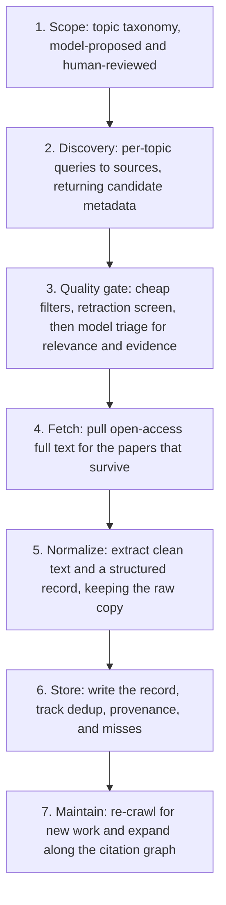

# Crawler / Corpus Builder: Design Spec

## What this is

Sana is a wellness and mental-health companion. Its answers should rest on real research rather than on whatever the model absorbed in training, or worse, hallucinations. This is the system that builds and maintains the body of research Sana draws from.

The starting point is a one-shot scraper: give it a query, it pulls a paper. That proved the idea, but a pile of papers pulled by query has no sense of what is missing, no signal for which papers to trust, and no way to stay current as new work comes out. This system replaces that with a corpus that is curated, graded for evidence quality, and maintained over years rather than built once. The scraper stays as the low-level fetch layer. Everything around it is new: deciding what to look for, judging what is worth keeping, and maintaining the result.

The corpus's direct consumer is the retrieval side of the backend, and for the engineers building it the corpus is a contract: by the time a record is read, the hard judgment has already happened, so retrieval can weight a meta-analysis over a case report without re-judging quality or guessing at provenance. The person talking to Sana never sees any of this. They experience it only as answers that hold up.

## Why we need it

A mental-health companion grounded in bad research is worse than one grounded in nothing, because it lends false authority to bad advice. Two failure modes drive most of the design.

The first is trusting the wrong paper. One small observational study and a meta-analysis of forty trials are not equal evidence, but a naive scrape treats them as if they were. Retracted work is worse still: grounding an answer in a paper pulled for fraud is a real harm, not a formatting bug. So the corpus has to carry how far each source can be trusted, and it has to keep retracted science out.

The second is missing the context that matters to people. PMC's core is biomedical, but the questions Sana gets rarely are: they touch psychology, someone's circumstances, how they grew up, the effects of things like being an immigrant child. A corpus that only covers the clinical literature will sound confident about biology and go quiet on the parts of a person's life that shape how they feel. Breadth is the difference between a companion that understands context and one that does not.

## How it works

The corpus is built by a sequence of stages, each with a defined input and output so one can change without disturbing the others. One rule cuts across all of them: machinery is code, judgment is the model. Fetching, storing, and de-duplicating are mechanical, so they stay ordinary code that can be tested without a network or a model in the loop. An LLM is trusted only where the task is real judgment: proposing topics to cover, and deciding whether a paper is relevant and what kind of study it is. Keeping the model at the edges keeps the core cheap to run and easy to reason about.

Scope is the one stage where a human stays in the loop: the model proposes the topic taxonomy and a person reviews it, because that tree decides what the whole corpus covers. Past that, two parts are worth getting right before anything else, because everything else can be rebuilt around them without much pain: what a record contains, and how sources plug in.

### The record

Every paper becomes one record capturing three things:

- **Its identity across sources.** The same paper can show up from different places under different IDs. Without one canonical identity, we count it twice.
- **Its evidence grade.** This is what the backend weights at retrieval time instead of treating every paper as equal.
- **Its provenance.** Why it was kept, when it was fetched, and where the text came from. This is what makes the corpus auditable, and it means the corpus can be re-curated or rebuilt from its inputs.

We also keep records for papers we could not get full text for, because knowing a relevant paper exists beats a gap we do not know about, and it means we can fetch the text later if it opens up. The exact field layout of a record is an engineering detail and lives with the scraper, not here.

### Identity and dedup

The same work arrives under a DOI from one source and a PMC ID from another, so a paper needs one canonical key. We use the OpenAlex work ID, because OpenAlex assigns every work an ID and maps it to the others, which makes it the natural thing to join on. The rare paper OpenAlex does not know falls back to an ID derived from its DOI, or failing that its PMC ID.

Everything is normalized to that key before we check whether we already have it, because otherwise the same paper slips in twice under two names. The check itself is a set of keys held in memory, which stays on the order of 15 MB even at a million papers, so it does not need a database behind it.

### Sources

Discovery and fetching are kept separate, so a new source can be added without touching the rest of the pipeline.

For discovery, OpenAlex is the primary source: it spans every discipline, carries a citation graph and concept tags, and points at open-access copies, which is what lets us reach the social-science and developmental work a biomedical index alone would miss. Europe PMC sits behind it as a second source for biomedical depth.

For text, we prefer the open-access copies that already come as extracted plain text, fall back to parsing whatever open-access URL the metadata points at, and failing both keep the record as metadata only.

### Quality and safety

This layer decides what earns a place. Breadth is deliberate, but it is not license to hoard, so the posture is: keep anything relevant that clears a floor, and tag the borderline rather than discard it.

Cheap, mechanical checks run first, because there is no point paying for a model's opinion on a paper that fails an obvious test: a paper has to be open-access or otherwise usable, off-topic venues are dropped, and a topic can ask for a recency window. Retraction is screened against the usual sources, and retracted work is excluded or flagged, never quietly used to ground an answer.

What survives gets an evidence grade, L1 through L5 from strongest to weakest:

- **L1:** meta-analyses and systematic reviews
- **L2:** randomized controlled trials
- **L3:** cohort and case-control studies
- **L4:** cross-sectional and observational work
- **L5:** case reports, opinion, and qualitative work

Nothing is dropped for landing low on that scale. The grade is a weight the backend applies, not a gate.

The model's part is narrow: working from a title and abstract, it decides whether a paper is relevant, infers what kind of study it is, and rates its own confidence. The mechanical filters run ahead of it so it never spends effort on papers that were never going to make it.

### Maintenance

The corpus is meant to last, and a corpus frozen at its first build is out of date within a year, so the interesting work is keeping it current, not building it once.

Re-crawling is incremental: topics are re-queried for work new since the last pass, and the dedup check absorbs the overlap, so a re-run adds new papers instead of reprocessing old ones.

Expansion follows citations. Starting from papers that already proved valuable, we walk out to what they cite and what cites them, and run those through the same quality gate as everything else. The walk is bounded by depth and per-topic limits, and the set of keys we have already seen keeps it from looping.

One rule holds throughout: when a limit cuts coverage short, that gets recorded rather than hidden, because it should never be possible to believe a topic was covered fully when a cap quietly stopped it halfway.

## Open questions

These are the parts we have chosen not to settle yet.

- **What the topic taxonomy contains.** The tree of topics to cover still needs a human pass. It is the seed the whole discovery step grows from.
- **How to grade evidence exactly.** The mapping from study type to grade, and how far to trust the model's read of a study over what the metadata claims.
- **How aggressively to clean text.** How much boilerplate to strip is easier to answer once retrieval exists to judge the result against.
- **Where the quality floor sits.** The threshold for keeping a paper should be tuned against real triage output rather than guessed up front.
- **Whether flat storage is enough.** A queryable index may be worth it eventually, but that is driven by what retrieval needs, so it waits until that side takes shape.
- **Whether to add a distilled layer.** Model-written summaries or extracted claims could sit on top of the corpus as a derived layer that never replaces the raw text. That waits until retrieval quality shows it is needed.
